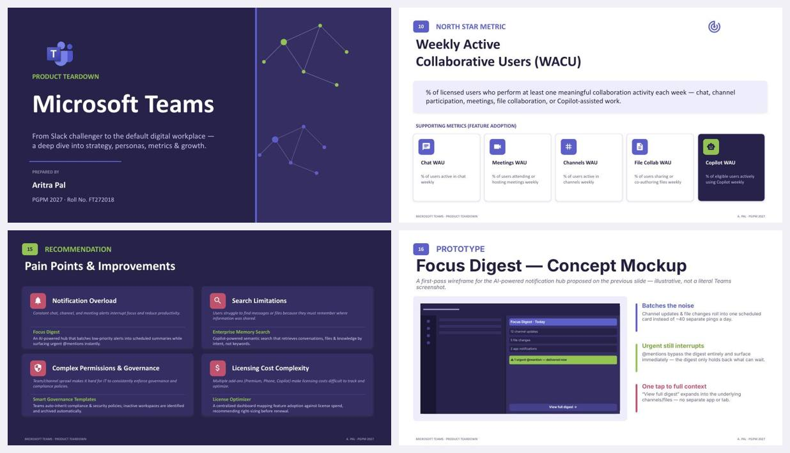

# Microsoft Teams — Product Teardown

**Full deck (23 slides):** [Microsoft-Teams-Product-Teardown.pdf](Microsoft-Teams-Product-Teardown.pdf)

## The question

Teams started in 2016 as Microsoft's answer to Slack. Today it's the default workplace for most large enterprises, with 320M monthly active users and 93% of the Fortune 100 on it. The same centralisation that makes Teams indispensable also makes it noisy. Chat, channels, meetings, files and apps all live in one surface, and every one of them can ping you.

**Teardown objective:** see how well Teams balances being a unified digital workplace against the friction that feature bloat and notification overload create, and propose fixes where that balance breaks.

## What I found

**Adoption is organisational first, individual second.** Nobody discovers Teams. IT buys it, configures it and provisions it. So onboarding is instant (zero setup, immediate file access), but there's no just-in-time education, and new users land straight in channel overload.

**The aha moment isn't the first chat.** It comes when a user co-authors a document, screen-shares and talks to the team without leaving Teams. That's step 7 of a 9-step journey, which is a long way in.

**Three personas, three different definitions of value:**

| Persona | Cares about | How Teams wins |
|---|---|---|
| Economic buyer (CIO / procurement) | TCO, vendor consolidation | Bundled into Microsoft 365, replacing several tools |
| IT administrator | Secure deployment, governance, compliance | One admin centre with built-in retention, DLP and lifecycle controls |
| End user | Ease of use, less context switching | Chat, meetings, calls, files and apps in one place |

**Teams competes on fit, not features.** Slack leads on messaging, Zoom on video, Google on simplicity and Webex on meeting-room infrastructure. Teams wins on cost, ecosystem integration and enterprise management.

**It's very hard to leave.** Switching costs come from four places: years of accumulated project knowledge, files that live in SharePoint/OneDrive, workflows built on bots and Power Automate, and compliance setups (retention, eDiscovery, legal holds) that would have to be rebuilt.

## North Star metric

**Weekly Active Collaborative Users (WACU):** the % of licensed users who do at least one meaningful collaboration action each week, such as chatting, joining a meeting, co-authoring a file or using Copilot.

It's measured against licensed seats, which is what enterprise customers pay for, and it only counts real collaboration, not someone who opened the app. WACU is supported by:

- **Feature adoption:** Chat, Meetings, Channels, File Collab and Copilot WAU
- **Enterprise health:** licence utilisation, cross-surface adoption (3+ surfaces), admin engagement
- **Trust & governance:** compliance-policy coverage, security incidents per 10K users, time to resolve policy violations

## Prioritisation

I scored seven feature areas on reach, impact and effort. Chat, Channels and Meetings are P0 core. **Copilot is P0 as well, and the highest priority**, even though it's high effort. It feeds Microsoft's highest-margin AI revenue and directly tackles the overload problem.

## Recommendations

| Pain point | Proposed fix |
|---|---|
| Notification overload | **Focus Digest:** an AI hub that batches low-priority alerts into scheduled summaries while urgent @mentions still get through instantly |
| Search limitations | **Enterprise Memory Search:** Copilot-powered semantic search that finds conversations and files by intent, not keywords |
| Complex permissions & governance | **Smart Governance Templates:** new teams inherit compliance policies automatically, and inactive workspaces are archived |
| Licensing cost complexity | **License Optimizer:** a dashboard that maps feature adoption to licence spend and recommends right-sizing before renewal |

I wireframed **Focus Digest** (slide 16). Twelve channel updates, five file changes and two app pings roll into one card. The one urgent @mention skips the digest and arrives immediately.

## Where Teams can grow

AI agents that act inside meetings and chat, not just summarise them · frontline workers (Shifts, Walkie-Talkie) · education workflows · a lighter cross-tenant guest experience to compete with Slack Connect · industry-specific templates.

---

*Prepared as part of my PGPM (Product Management) coursework at Great Lakes Institute of Management. Figures are from Microsoft's public earnings disclosures and product documentation.*
